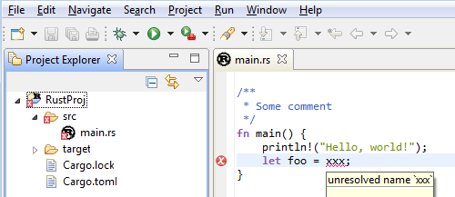
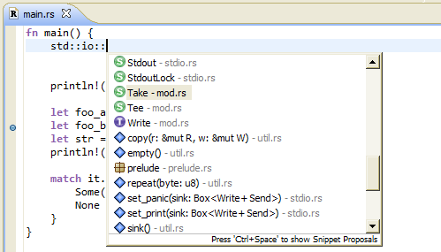
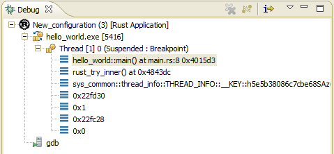

## RustDT

### Features:

 * Source code editor, with:
   * Syntax highlighting, configurable. Dark theme support.
   * Automatic indent/de-indent and brace completion on certain keypresses (Enter, Backspace, Delete).
 * Project builder, using Cargo.
   * Build errors reported inline in the editor (as squiggly lines) and Project Explorer.
   * Can automatically create launch configurations from Cargo binary or test targets.

|  `Editor and workbench screenshot` |
|----|

 * Content Assist: Code Completion and Find Definition using [Racer](https://github.com/phildawes/racer).
 * Content Assist: code snippets (configurable).

|  `Content Assist screenshot` |
|----| 
   
##### Debugging functionality. 
Fully featured GDB debugger support (uses Eclipse CDT's GDB integration)
  * Stop/resume program execution. Listing program threads and stack frame contents.
  * Setting breakpoints, watchpoints (breakpoint on data/variables), tracepoints. Breakpoint conditions.
  * Stack variables inspection view. Expression watch and view. Disassembly view.
  * Non-stop mode (for supported GBDs). Reverse debugging (for supported GDB targets).

Rust specific features:
 * Automatically tries to configure rust-gdb pretty printers, if found.

|  `Execution stopped on a conditional breakpoint` |
|----|
  
