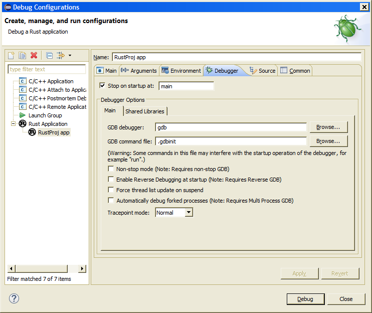

## User Guide

*Note:* For an overview of RustDT features, see [Features](Features.md#features). This also serves to document 
what overall functionalities are available.

## Configuration

A [Rust installation](http://www.rust-lang.org/install.html) is required for most IDE functionality. The path to the installation should be configured in the `Rust` preference page, accessed from the menu `Window / Preferences`.

Additionally, for functionality such as code completion, you will need:
 * The [Rust sources package](https://www.rust-lang.org/downloads.html) (click "Source"). This package is not included in the Rust intallation, so it must be obtained separately (see [this Rust bug](https://github.com/rust-lang/rust/issues/19535)). Configure the `Rust 'src' Directory` to point to the 'src' directory of this package.
 * The [Racer](https://github.com/phildawes/racer) tool. It is recommended to use the "Download" button in the preference page to have RustDT automatically download Racer (this will use `cargo install` - as such the Rust installation must already be configured).
 
For functionality such as Outline/Quick-Outline and on-the-fly parsing errors, you will need the [Rainicorn](https://github.com/RustDT/Rainicorn) tool. Same as with Racer, you can use the "Download" button to install it.

### Eclipse basics

If you are new to Eclipse, you can learn some of the basics of the Eclipse IDE with this short intro article: 
[An introduction to Eclipse for Visual Studio users
](http://www.ibm.com/developerworks/opensource/library/os-eclipse-visualstudio/)

Also, to improve Eclipse performance and startup time, it is recommended you tweak the JVM parameters. There is a tool called Eclipse Optimizer that can do that automatically, it is recommended you use it. Read more about it [here](http://www.infoq.com/news/2015/03/eclipse-optimizer). (Installing/enabling the JRebel optimization is not necessary as that only applies to Java developers)

### Project setup

##### Project creation:
A new Rust project is created with the New Project Wizard: from the Project Explorer context menu, select `New / Project...` and then `Rust / Rust Cargo Project`. The same wizard can be used to add a pre-existing Cargo project: simply use the location field to select a pre-existing directory.

### Editor and Navigation

##### Editor newline auto-indentation:
The editor will auto-indent new lines after an Enter is pressed. Pressing Backspace with the cursor after the indent characters in the start of the line will delete the indent and preceding newline, thus joining the rest of the line with the previous line. Pressing Delete before a newline will have an identical effect.
This is unlike most source editors - if instead you want to just remove one level of indent (or delete the preceding Tab), press Shift-Tab. 

##### Content Assist / Open Definition:
Content Assist (also know as Code Completion, Auto Complete) is invoked with `Ctrl-Space`. 

The Open Definition functionality is invoked by pressing F3 in the source editor. 
Open Definition is also available in the editor context menu and by means of editor *hyper-linking* 
(hold Ctrl and click on a reference with the mouse cursor). 

Content Assist and Open Definition are provided by means of the [Racer](https://github.com/phildawes/racer) tool (see the configuration section above).

> If there is a problem with these operations, and you need a diagnostics log, 
the output of Racer can be seen in the `Rust Tools Log` console page in the Eclipse Console view.

### Launching:
To run a Rust project that builds to an executable, you will need to create a launch configuration. Locate the main menu, open 'Run' / 'Run Configurations...'. Then double click 'Rust Application" to create a new Rust launch, and configure it accordingly. You can run these launches from the 'Run Configurations...', or for quicker access, from the Launch button in the Eclipse toolbar.

Alternatively, to automatically create and run a launch configuration (if a matching one doesn't exist already), you can select a Rust project in the workspace explorer, open the context menu, and do 'Run As...' / 'Rust Application'. (or 'Debug As...' for debugging instead). If a matching configuration exists already, that one will be run. The same process can be applied to Rust files in the `tests` folder, to run the corresponding Cargo integration test.

Whenever a launch is requested, a build will be performed beforehand. This behavior can be configured under general Eclipse settings, or in the launch configuration.

##### Debugging

You can debug a Rust program by running a launch in debug mode. You will also need GDB. 

| **OS X note:** _The GDB that is included with OS X doesn't work properly. You'll need to install the latest GDB from Homebrew. See [this article](http://ntraft.com/installing-gdb-on-os-x-mavericks/) for details._ |
|----|

| **Windows note:** _Using Cygwin GDB doesn't work properly. The recommended way to debug in Windows is to use the GDB of [TDM-GCC](http://tdm-gcc.tdragon.net/), or the one of [mingw-w64](http://mingw-w64.org/)._ |
|----|

To configure debug options (in particular, the path to the debugger to use), open the launch under 'Run' / 'Debug Configurations...', and then navigate to the 'Debugger' tab in the desired launch configuration:

<a><a/> 

**Note that for debugging to work**, the program must be compiled with debug symbols information, and those debug symbols must be on a format that GDB understands. Otherwise you will get GDB error messages such "(no debugging symbols found)" or "file format not recognized".

##### GDB Pretty printers
The Rust GDB pretty-printers are extensions to GDB that enable a better display of certain Rust native types, such as enums, slices, and vectors. On the command-line, there are normally enabled by invoking the `rust-gdb` shell script included with Rust, but this approach will not work with RustDT. Instead, RustDT will try to automatically set up the GDB pretty printing extensions when launching in debug mode. GDB will be configured to load them from either the `${RUST_ROOT}/rustc/lib/rustlib/etc` or `${RUST_ROOT}/lib/rustlib/etc` location, where `${RUST_ROOT}` is the directory of the Rust installation, as configured in the RustDT preferences.

** Warning: ** Having the pretty-printers enabled may sometimes cause slowdown when debugging, if the Variables view is visible, and the value of uninitialized variables is displayed.

** Note for Windows: ** The Rust pretty printers are not included by default in the Windows installation of Rust. To enable them, you must obtain them separately. See this article for instructions on how to do so: http://stackoverflow.com/questions/33570021/how-to-set-up-gdb-for-debugging-rust-programs-in-windows/33570022#33570022
